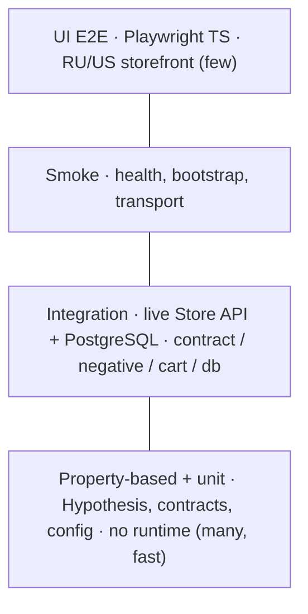
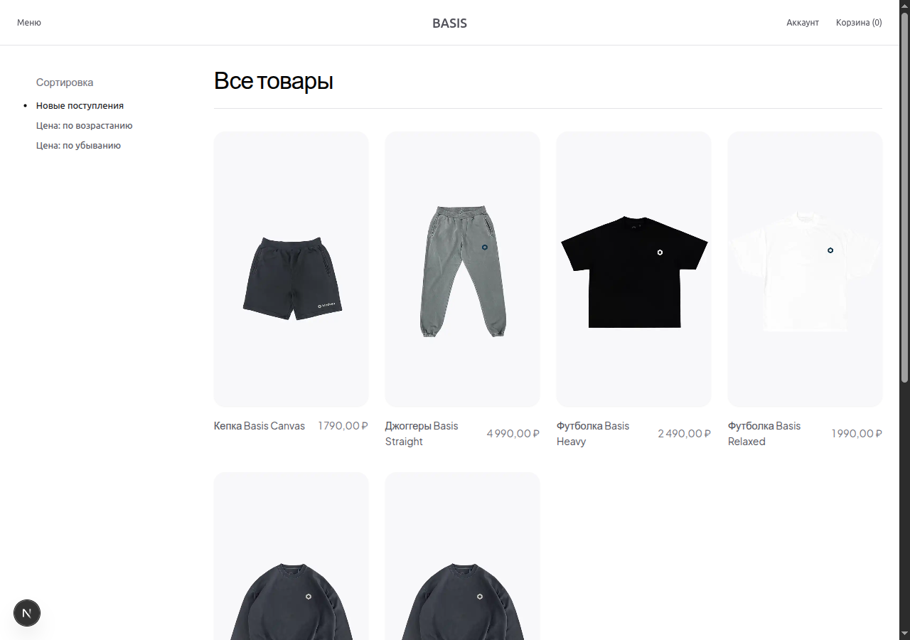

# medusa-api-quality-gate

[](https://github.com/vtestah/medusa-api-quality-gate/actions/workflows/quality-gate.yml)
[](https://github.com/vtestah/medusa-api-quality-gate/actions/workflows/integration.yml)
[](https://github.com/vtestah/medusa-api-quality-gate/actions/workflows/e2e.yml)
[](LICENSE)


An API quality gate for a headless commerce stack. It tests a real **Medusa.js** runtime (PostgreSQL + Redis) and a **Next.js** storefront localized for two markets, Russia and the United States. Everything comes up with Docker Compose, so the tests hit the actual system instead of mocks, both locally and in CI.

Two layers:

- **API quality gate**: Python and pytest against the live Store API and PostgreSQL.
- **UI E2E**: Playwright (TypeScript) against the localized RU/US storefront.

## What it covers

- **Contracts**: strict Store API validation with Pydantic v2, plus round-trip checks (serialize, then re-parse).
- **Property-based (Hypothesis)**: invariants for contracts, cart math, client pre-flight, and config. No runtime needed, so they run on every push.
- **Negative cases**: auth, malformed payloads, and boundary values.
- **Cart and checkout**: market-driven shipping for RU and US, with totals that add up.
- **Cross-layer checks**: read-only PostgreSQL reconciliation of API state against the database.
- **Admin API**: login, and authorization that rejects missing or bad tokens.
- **UI E2E**: Page Object Model and per-market projects against the storefront.
- **Mutation testing (mutmut)** on the domain models, to confirm the tests bite when the code breaks.

## How it's tested

Cheap, fast checks at the base; slower runtime-bound ones on top.



The base runs on every push with no runtime. The integration layer talks to the live Store API and PostgreSQL: those tests skip locally when the stack is down, and run for real in CI, where the pipeline boots the runtime first. That keeps "infra is down" separate from "a test actually failed".

## Screenshot



That's the `/ru` market. The `/us` market serves the same catalog in English with USD pricing.

## Quick start

```bash
make up      # Medusa + PostgreSQL + Redis + storefront (Docker)
make seed    # seed demo data and sync the publishable key
make test    # run the pytest suite
make e2e     # Playwright UI E2E (needs the runtime up)
```

`make help` lists every target. CI publishes a live Allure report at
<https://vtestah.github.io/medusa-api-quality-gate/>.

## Layout

```text
medusa-api-quality-gate/
├── quality-gate/        # Python/pytest API quality gate (clients, models, db, tests)
├── e2e/                 # Playwright (TypeScript) UI E2E for the RU/US storefront
├── apps/
│   ├── medusa/          # system under test: Medusa backend
│   └── storefront/      # Next.js storefront (localized RU/US)
├── k6/                  # k6 smoke and load scripts
├── docs/                # test plan, ADRs, and reference docs
├── docker-compose.yml
└── Makefile
```

## Docs

- [quality-gate/README.md](quality-gate/README.md): the Python framework and how to run it
- [e2e/README.md](e2e/README.md): the Playwright suite
- [docs/TEST_PLAN.md](docs/TEST_PLAN.md): scope, layers, data, and acceptance
- [docs/manual-checks.md](docs/manual-checks.md): curl checks against a running stack
- [docs/localization.md](docs/localization.md): markets, currencies, and the localization split
- [docs/runtime.md](docs/runtime.md): URLs, Docker notes, and the package-manager rule
- [docs/adr/](docs/adr/): the decisions behind the setup

## Roadmap

Done: strict contract validation, negative scenarios, cart and market shipping, cross-layer PostgreSQL reconciliation, property-based tests, Admin API auth, mutation testing, live integration in CI, Playwright RU/US E2E, and an Allure report on Pages.

Next: Schemathesis fuzzing from an OpenAPI schema.
