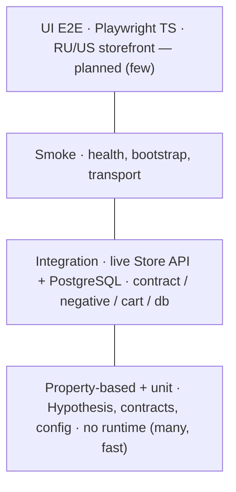

# medusa-api-quality-gate

[](https://github.com/vtestah/medusa-api-quality-gate/actions/workflows/quality-gate.yml)

[](LICENSE)


Public portfolio repository for a **Senior SDET** track focused on **API quality gates** for a headless commerce stack. The system under test is a real **Medusa.js** runtime backed by **PostgreSQL + Redis**; the target UI is a **Next.js** storefront localized as a dual-market demo: Russia first, United States second.

The Python quality gate is the primary pillar (API/contract/state); a TypeScript + Playwright UI layer against the localized storefront is the second pillar (in progress, see [Roadmap](#roadmap)).

## QA Highlights

- **Contract testing** — strict Store API validation with Pydantic v2 and round-trip (serialize → deserialize) checks.
- **Property-based testing (Hypothesis)** — invariants for contracts, cart aggregation, client pre-flight, and fail-fast config; runs on every push without a runtime.
- **Negative testing** — auth, malformed payloads, and boundary values against the Store API.
- **Cart / checkout flows** — market-driven shipping for RU and US.
- **Cross-layer state verification** — read-only PostgreSQL reconciliation of API state vs the database.
- **Real SUT, not mocks** — tests target a live Medusa runtime brought up via Docker Compose.
- **Service Object clients** — typed clients for health, regions, products, categories, cart, shipping.
- **CI quality gate** — ruff + mypy strict + pytest with coverage on every push (coverage floor enforced at `fail_under=70`).

## Testing Strategy

A test pyramid: a wide base of fast property-based and unit tests that need no runtime, an integration layer against the live Store API and PostgreSQL, smoke checks on top, and a planned UI E2E cap.



Test layers:

- **property-based (Hypothesis)** for pure-logic invariants — run on every push, no runtime needed;
- **integration** against the live Store API and PostgreSQL, guarded to skip cleanly when the runtime is down (CI brings the runtime up so they actually execute);
- **smoke / unit** for transport, configuration, and data factories;
- **UI E2E (Playwright, TypeScript)** against the localized RU/US storefront — *planned, Phase 3*.

See [`quality-gate/README.md`](quality-gate/README.md) for the full testing strategy.

## Python Quality Gate

Python API automation lives in `quality-gate/` and targets the live Medusa runtime from this
repository. It runs as a CI quality gate (ruff + mypy strict + pytest with coverage) on every push.

Structure:

```text
quality-gate/
├── pyproject.toml
├── src/quality_gate/
│   ├── clients/   # Service Object clients: health, regions, products, categories, cart, shipping
│   ├── models/    # Pydantic v2 contracts: regions, products, cart, errors + round-trip helpers
│   ├── db/        # read-only PostgreSQL helpers and cross-layer reconciler
│   ├── config.py  # env-based Settings with RU/US market profiles
│   └── test_data.py
└── tests/
    ├── smoke/         # fast runtime and bootstrap checks
    ├── contract/      # strict response validation + round-trip (incl. property-based)
    ├── negative/      # Store API negative input scenarios
    ├── cart/          # cart/checkout flows and market-driven shipping (incl. property-based)
    ├── localization/  # x-medusa-locale contract checks
    └── db/            # cross-layer PostgreSQL reconciliation
```

Quick commands (or use the [Makefile](#one-command-demo)):

```bash
pnpm quality-gate:venv
pnpm quality-gate:install
pnpm quality-gate:test:smoke
pnpm quality-gate:test:localization
```

## Why This Matters For QA

- Contract tests need a real SUT, not hand-waved mocks.
- State verification becomes possible once the backend and database are reproducible.
- Market routing is a first-class runtime contract, not a cosmetic i18n toggle.
- Region-driven pricing is testable independently from UI rendering.
- Future Python and Playwright clients can target one canonical API surface at `http://localhost:9000`.

This is the backend analogue of testing a real frontend app with the correct store, router context, and seeded state instead of snapshotting empty shells.

## One-Command Demo

```bash
make help     # list targets
make up       # Medusa + PostgreSQL + Redis + storefront
make seed     # seed demo data and sync the publishable key
make setup    # create venv and install quality-gate[dev]
make test     # run the pytest suite
make lint     # ruff + mypy strict (same as CI)
```

## Architecture

```text
medusa-api-quality-gate/
├── package.json         # Root scripts for Docker runtime
├── pnpm-workspace.yaml  # Monorepo policy for all JS apps
├── quality-gate/        # Python pytest framework for API quality gates
├── apps/
│   ├── medusa/          # System under test: Medusa backend
│   └── storefront/      # Next.js target UI (localized RU/US) for browser automation
├── docker-compose.yml   # postgres + redis + medusa + storefront
├── Makefile             # one-command demo
└── README.md
```

## Dual-Market Demo

`Basis` is modeled as a fashion-basics storefront with one canonical catalog model and two public markets:

| Market | Path | Region | Currency | UI language | Shipping |
| --- | --- | --- | --- | --- | --- |
| Russia | `/ru` | `Russia` | `RUB` | Russian chrome | `Курьер`, `ПВЗ`, `Самовывоз` |
| United States | `/us` | `United States` | `USD` | English chrome | `Standard Shipping`, `Express Shipping` |

Catalog handles remain canonical in English on purpose, but display content is served through the Medusa Translation Module. That gives us two clean layers:

- stable English identifiers for fixtures, URLs, and contracts
- localized product/category/collection content for `/ru` and `/us`

## UI Localization Library

Storefront shell localization is powered by `next-intl`, while the Medusa Translation Module owns catalog translations.

```text
/ru -> region: Russia, currency: RUB, locale: ru-RU
/us -> region: United States, currency: USD, locale: en-US
```

This split is deliberate:

- `region` controls pricing, shipping methods, and market behavior
- `next-intl` controls typed UI dictionaries for storefront chrome
- Medusa Translation Module serves translated product, category, collection, variant, and shipping content

Key files:

- `apps/storefront/src/i18n/messages/ru-RU.json`
- `apps/storefront/src/i18n/messages/en-US.json`
- `apps/storefront/src/i18n/request.ts`
- `apps/storefront/src/middleware.ts`

Runtime proof points:

- `/ru` renders Russian nav, hero, footer, and account login copy
- `/us` renders English nav, hero, footer, and account login copy
- metadata titles also switch by locale: `Basis | Российский storefront demo` vs `Basis | US storefront demo`
- `/ru/store` renders Russian product titles, category labels, collection titles, and category descriptions
- `/us/store` renders English catalog content and USD pricing

## Runtime URLs

- Storefront: `http://localhost:8000`
- Russian storefront: `http://localhost:8000/ru`
- US storefront: `http://localhost:8000/us`
- Medusa API: `http://localhost:9000`
- Medusa health: `http://localhost:9000/health`
- Medusa admin: `http://localhost:9000/app`
- PostgreSQL host access: `localhost:5433`

## Quick Start

```bash
pnpm docker:up
```

```bash
pnpm docker:seed-demo
```

```bash
curl http://localhost:9000/health
```

```bash
pnpm quality-gate:venv
pnpm quality-gate:bootstrap-status
pnpm quality-gate:bootstrap-status:venv
pnpm quality-gate:install
pnpm quality-gate:doctor
pnpm quality-gate:test:smoke
```

```bash
docker compose exec medusa pnpm exec medusa user -e admin@example.com -p supersecret
```

`pnpm docker:seed-demo` does three things:

- runs the Medusa seed
- syncs the newly generated publishable API key into `.env` and `apps/storefront/.env.local`
- restarts the storefront with the current key

## README-Driven Verification

### HTTP checks

```bash
curl -I http://localhost:8000
curl -I http://localhost:8000/ru
curl -I http://localhost:8000/us
```

Expected behavior:

- `/` redirects to `/ru`
- `/ru` resolves to the RU market
- `/us` resolves to the US market

### Market contract checks

```bash
curl http://localhost:9000/store/regions \
  -H 'x-publishable-api-key: <publishable-key>'
```

Expected backend state:

- exactly two regions: `ru`, `us`
- default store currency: `rub`
- secondary store currency: `usd`
- product catalog count: `6`
- category count: `4`

### Localization checks

```bash
curl 'http://localhost:9000/store/products?handle=basis-heavy-tee&fields=title,description,material' \
  -H 'x-publishable-api-key: <publishable-key>' \
  -H 'x-medusa-locale: ru-RU'
```

Expected RU response:

- `title` is Russian
- `description` is Russian
- `material` is Russian

```bash
curl 'http://localhost:9000/store/product-categories?handle=hoodies&fields=name,description' \
  -H 'x-publishable-api-key: <publishable-key>' \
  -H 'x-medusa-locale: ru-RU'
```

Expected RU response:

- category `name` is `Худи`
- category `description` is Russian

### Shipping checks

RU cart should expose:

- `Курьер`
- `ПВЗ`
- `Самовывоз`

US cart should expose:

- `Standard Shipping`
- `Express Shipping`

## Package Manager Policy

- Entire repository: `pnpm`
- Reason: officially supported by Medusa, fast enough for monorepo work, and consistent across backend and storefront
- Deliberately not used: mixed `npm` / `bun` policy

## Docker Notes

- The runtime follows the Medusa Docker guide shape with `/server`, `start.sh`, health checks, and Docker-native service discovery.
- The infra baseline intentionally uses latest stable major services: `postgres:18-alpine` and `redis:8-alpine`.
- PostgreSQL 18 uses the recommended volume mount at `/var/lib/postgresql`.
- Host PostgreSQL is exposed on `5433`, not `5432`, to avoid collisions with an already running local database.
- `5173` is intentionally not published to the host anymore; the real admin entrypoint is `http://localhost:9000/app`.
- Storefront defaults to `ru`, not `gb`.

## Roadmap

Delivered:

- Strict contract validation of Store API responses (Pydantic v2 + round-trip checks)
- Store API negative scenarios (auth, malformed payloads, boundary values)
- Cart and checkout flows with market-driven shipping for RU and US
- Cross-layer PostgreSQL reconciliation of API state
- Property-based tests for pure logic and CI quality gates (ruff, mypy strict, coverage)

Next:

- Integration tests executed live in CI (runtime brought up in the pipeline)
- Playwright UI checks (TypeScript) against the localized storefront
- Admin API and auth-heavy flows
- Schemathesis fuzzing driven by the Medusa OpenAPI schema
